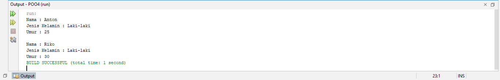

# POO-4

### membuat class person
```java
public class Person {
    // Atribut dengan access modifier private
    private String nama;
    private String jenisKelamin;
    private int umur;

    // Constructor kosong
    public Person() {}

    // Constructor dengan parameter
    public Person(String nama, String jenisKelamin, int umur) {
        this.nama = nama;
        this.jenisKelamin = jenisKelamin;
        this.umur = umur;
    }

    // Method setter
    public void setNama(String nama) {
        this.nama = nama;
    }

    public void setJenisKelamin(String jenisKelamin) {
        this.jenisKelamin = jenisKelamin;
    }

    public void setUmur(int umur) {
        this.umur = umur;
    }

    // Method getter
    public String getNama() {
        return nama;
    }

    public String getJenisKelamin() {
        return jenisKelamin;
    }

    public int getUmur() {
        return umur;
    }
    }
```

### membuat class main
```java
public class Main {
    public static void main(String[] args) {
        // Membuat dua buah objek dari class Person
        Person anton = new Person("Anton", "Laki-laki", 25);
        Person riko = new Person();

        // Menggunakan method setter untuk mengisi atribut
        riko.setNama("Riko");
        riko.setJenisKelamin("Laki-laki");
        riko.setUmur(30);

        // Menggunakan method getter untuk menampilkan atribut
        System.out.println("Nama : " + anton.getNama());
        System.out.println("Jenis Kelamin : " + anton.getJenisKelamin());
        System.out.println("Umur : " + anton.getUmur());

        System.out.println("\nNama : " + riko.getNama());
        System.out.println("Jenis Kelamin : " + riko.getJenisKelamin());
        System.out.println("Umur : " + riko.getUmur());
    }
}
```

### output
